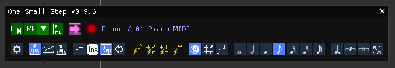

One Small Step
{:style="text-align: center; font-size:40px; font-weight:bold"}

Alternative step input tool for Reaper
{:style="text-align: center;color:grey; font-size:20px"}

{:style="text-align: center"}

# Documentation index

- Documentation for [v0.9.6](v0.9.6.html)