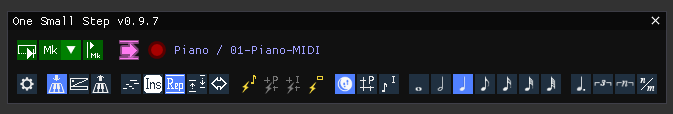

 

One Small Step - v0.9.14
{:style="text-align: center; font-size:40px; font-weight:bold"}

Alternative step input tool for Reaper
{:style="text-align: center;color:grey; font-size:20px"}

 

{:style="text-align: center"}

 

User Manual
{:style="text-align: center;font-size:30px"}

 

# Table of Contents

1. toc
{:toc}

# Purpose

**One Small Step** is a tool for performing **MIDI note step input** in REAPER. It is an alternative to Reaper's standard step input, offering more control and tools, and allowing the use of the **sustain pedal** (+ keyboard modifier keys) for performing actions.

It offers multiple input methods, based on **keyboard press/release events**, or strict **sustain pedal/action validation**.

It has four edit modes : **Write**, **Insert**, **Replace**, **Repitch** for **inputing**, **inserting**, **erasing**, **translating** notes with minimal use of the mouse. It will work outside of the MIDI editor (directly in the **arrange view**) ; this offers additional comfort and can speed up your workflow.

It also has a **snappy navigation** mode with the sustain pedal, over the project grid, the item grid, note bounds, item bounds, etc.

It also addresses some issues with workflows that use the input FX chain for routing/transposing MIDI (because Reaper's standard input bypasses the fx input chain, see the last section for an explanation).

# Author

Ben 'Talagan' Babut

# License

MIT.

Since it is a script, the source code is the tool itself. But it's distributed through reapack, and you can find the source repository [here on github](https://github.com/ReaTeam/Reascripts).

# Discussion

The dedicated thread on REAPER forums is located here :

[forum.cockos.com/showthread.php?t=288076](https://forum.cockos.com/showthread.php?t=288076)

# Installation

The current version is available through [ReaPack](https://reapack.com), from the official ReaTeam/Reascripts repository. To work, it also needs the following components from Reapack :

- **JS_ReaScriptAPI** by Julian Sader
- The adapted **ReaImGui** library by Christian Fillion
- The **SWS/S&M** extension by the SWS team

If you forget to install them, OSS will remind you to do so anyway and directly point you to the right place.

A restart of Reaper is needed after install.

# Important configuration note

For a better comfort with One Small Step, **you're strongly encouraged to enable the following option in Reaper** :

{:style="text-align: center"}

That way, all editing operations, when you perform an undo, will restore the edit cursor to where it was.

# Documentation

## Launching One Small Step

After install, launch the **talagan_One Small Step.lua** action. The **One Small Step** window will open. As long as the window is visible, OSS is active.

{:style="text-align: center"}

You can add a toolbar button in Reaper to toggle OSS. This will open/close the window and is quite convenient. A toolbar icon is provided with the installation (toolbar_one_small_step.png) :

{:style="text-align: center"}

At the top of OSS's window, the name of the **target MIDI track / item / take** will be displayed if there's one eligible that matches your current cursor position and current selection.

It is important to note that the track you're working on should be **armed for record** (OSS will give you an indication if you forgot to arm the recording). If everything's ready, a red circle will glow, meaning that in this configuration, One Small Step is able to do its job (listen to MIDI events, and step input/patch the current MIDI item). When you're done with OSS, just close the window and it will be inactive.

You can also temporarily disable OSS by clicking on the red glowing circle. That way, you can keep the window visible and use your MIDI controller without any editing effect from OSS.

{:style="text-align: center"}

## How it works

Under the hood, OSS installs a companion helper JSFX on your tracks, in the input FX chain, to listen to MIDI events. That is why the record mode should be enabled, as well as the MIDI input be configured on the target track. The instances of this JSFX companion are automatically cleared when closing OSS's window (you can disable this behavior, and use the **Cleanup helper JSFXs** action instead).

## Input methods overview

One Small Step has three input methods : **Key Press**, **Key Release** and **Punch**.

### Key Press method {:style="vertical-align:bottom"}

With the **Key Press method**, notes are added (or deleted) on MIDI Controller **key press** events. It is suitable for inputing notes at a high pace. It is not error tolerant (you get what you play), but will only aggregate chords if keys are pressed simultaneously.

{:style="text-align: center"}

You can configure the response times with the following parameters :

{:style="text-align: center"}

The **Chord Aggregation time** corresponds to the time window in which notes should be pressed together to be considered a chord (else, events will be treated separately).

The **Sustain Inertia** is the time after which a key is considered "sticky" when entering another note. After this time, the first key will be considered held and extended.

{:style="text-align: center"}

You may find this useful in certain circumstances or annoying in others, so that behavior can be disabled.

### Key Release method {:style="vertical-align:bottom"}

With the **Key Release method**, notes are added (or deleted) on MIDI Controller **key release** events. It is suitable for inputing notes at a low pace, correcting things by ear, especially for chords. This method is error tolerant, but tends to aggregate and skip notes easily when playing fast. This is pretty much the same as Reaper's default step input method.

{:style="text-align: center"}

You can configure the response times with the following parameters :

{:style="text-align: center"}

The forget time corresponds to the time window after which, if no other keys are released, the released keys are aggregated as a chord.

### Punch method {:style="vertical-align:bottom"}

With the **Punch method**, notes are NOT added on MIDI Controller key press/release events. Only the **sustain pedal** or **commit (or commit back) action** adds (or deletes) notes. It is suitable for validating everything by ear before input. Useful when testing chords or melodic ideas.

{:style="text-align: center"}

## Sustain Pedal / Commit Actions

The **Sustain Pedal** can be used for various tasks when doing step input with **One Small Step**. It acts as a **validator** for the current task (inputing or stepping back), with all input methods and within all edit modes.

Alternatively, you can call OneSmallStep's **Commit** action from Reaper, which has the same effect. This is convenient if you don't have a sustain pedal, or if it feels more natural to you.

### Extending held notes

The sustain pedal will also **extend already held notes**. If you're working with a grid for example, this allows you to skip the configuration of the note length :

{:style="text-align: center"}

Since with the **Key Press method**, notes are already written (and validated) when keys are pressed, the **Sustain Pedal** will only **extend held notes**. To summarize, the **Sustain Pedal** :

 

|                         | Validates  | Extends |
|-------------------------|------------|---------|
| **KeyPress Method**     |            |     x   |
| **Punch Method**        |  x         |     x   |
| **KeyRelease Method**   |  x         |     x   |

### Stepping back

All actions have an associated backward behavior. It may be triggered by holding the **step back** modifier key when pressing the sustain pedal, which can be configured to your will :

{:style="text-align: center"}

See the effect of the **step back**, (and step forward) in **Navigate** mode :

{:style="text-align: center"}

## Edit modes

There are four **edit modes**, and one **navigation mode**. Here's an overview of all modes.

### Write mode {:style="vertical-align:bottom"}

It's the default mode. **Notes are added** over the grid to what already exists.

When stepping back, **notes are deleted selectively** (you should press the corresponding note, then press the pedal + back modifier, or call the commit back action) :

{:style="text-align: center"}

If no held keys match the current notes immediately preceding the cursor, the cursor will not rewind, unless you check the option for that.

### Insert mode {:style="vertical-align:bottom"}

**Notes are added**, and notes that follow are shifted forward.

When stepping back, **everything that is under the cursor is deleted** (so notes will be deleted or shorten). Notes that follow the edit cursor are shifted back.

{:style="text-align: center"}

The insert mode has specific options to handle cases when one press/hold keys while the edit cursor is the middle of existing notes.

{:style="text-align: center"}

There are two options, to define different behaviours for input notes :

- that match an existing note
- that do not match any existing notes

The possible behaviours are :

* Leave untouched

{:style="text-align: center"}

* Cut

{:style="text-align: center"}

* Extend

{:style="text-align: center"}

* Cut and insert (only available for input notes that match existing notes)

{:style="text-align: center"}

Those behaviours are of course compatible with chords, and may happen on commit action/sustain pedal without any pressed/held keys :

{:style="text-align: center"}

{:style="text-align: center"}

And of course, this may result in hybrid results when having both matching/non matching notes

{:style="text-align: center"}

### Replace mode {:style="vertical-align:bottom"}

**Notes are added**, and what was there is deleted. This can suppress or shorten notes, make holes, etc. Nothing is shifted.

When stepping back, **everything that is under the cursor is deleted** (so notes will be deleted or shorten).  Nothing is shifted.

{:style="text-align: center"}

### Repitch mode {:style="vertical-align:bottom"}

**Note pitches are modified**, but the notes stay in place. When replacing chords, the exact same number of notes should be played or the cursor will not advance. If the cursor is not aligned with a note start, the cursor will not move (or will jump to next note start if you have ticked the "Allow navigating on key press/release events"). The sustain pedal will navigate forward to next note start. An option allows you to change the aggregation time window for chords.

When stepping back, this mode will just rewind to the precedent note start.

An option also allows to affect the velocities of changed notes (and you can also rework only velocities if you like, but the monitoring will not match what you're playing of course).

{:style="text-align: center"}

### Navigate mode {:style="vertical-align:bottom"}

This mode moves the cursor, with snapping. It is convenient to wedge the cursor in place when notes do not align with the grid, or simply, to quickly span things. It works forward or backward.

{:style="text-align: center"}

The snapping options may be found in the toolbar, in yellow :

{:style="text-align: center"}

Currently, you can snap to **note bounds**, **item bounds**, **project grid**, or **item grid**.

### Stretch/Compress mode (Insert mode alternative) {:style="vertical-align:bottom"}

This mode is the Insert mode alternative, and is toggled when you set the operation marker by clicking on the mode indicator icon (just next to the playback widget, on the right).

It does not add or remove notes, but stretches the content between the marker and the cursor (and pushes back what's after the cursor).

The back operation is compression.

{:style="text-align: center"}

### Stuff/Unstuff mode (Replace mode alternative) {:style="vertical-align:bottom"}

This mode is the Replace mode alternative, and is toggled when you set the operation marker by clicking on the mode indicator icon (just next to the playback widget, on the right).

In a fixed time window, between the operation marker and the cursor, notes (and rests) are pushed at the end, and other ones are compressed. This is suitable for writing, for example, long runs with odd or prime number of notes on fixed time sections.

The time reference is the first note of the time window. You can apply a modifier (the note length buttons change to show multipliers x4, x2, x1 etc).

The back operation pops out notes from the time window.

{:style="text-align: center"}

### Edit mode modifier keys

You can change the current mode by clicking on the mode icon in the mode edit bar {:style="vertical-align:bottom"}, but also, you can assign **modifier keys** to each one. That way, everything is fully configurable. You can chose to use modifier keys or not, you can chose to use the mini toolbar buttons or you can make your own mix :

{:style="text-align: center"}

### Summary

|                         | Step Forward  | Step Back |
|-------------------------|------------|---------|
| **Write**          | Add notes SPA : Add rests (advances) | Selective note delete |
| **Insert**         | Add notes, shift following notes SPA : Add rests, shift following notes  | Shorten/Remove notes, shift back following notes      |
| **Replace**        | Add notes, shorten/delete/eat notes (do not shift) SPA : Shorten/delete/eat notes (do not shift) | Shorten/Remove notes (do not shift) |
| **Repitch**        | Change note(s) pitch/vel + navigate to next note SPA : Navigate to next note | Navigate to precedent note start |
| **Stretch**        | Stretch the time window between marker and cursor | Compress the time window between and cursor |
| **Stuff**          | Stuff notes into the time window between marker and cursor) | Pops out notes from the time window between marker and cursor           |
| **Navigate**       | Move edit cursor forward (with snap) | Move edit cursor backward (with snap)    |

{:style="text-align: right"}
SPA = Sustain Pedal Alone

## Note Length

When performing an edit action (Write/Insert/Replace), you have to choose a time length for inputing notes. This can be an absolute value (quarter note, half note, etc...)

{:style="text-align: center"}

or you can work on the basis of **the project grid** or the **item note configuration**

{:style="text-align: center"}

In the second case, you can apply modification factors to the base value. It can be noted that the grid swing is applied, like in this example :

{:style="text-align: center"}

## Velocity Limiter

You may interested in reducing the range of possible input velocities. You can find the Velocity Limiter in the input settings :

{:style="text-align: center"}

The limiter offers two modes for limiting velocities, Clamp and Linear. Here are the two corresponding curves

{:style="text-align: center"}
 

## Playback

One Small Step offers a convenient way to replay what you've written, without having to modify the edit cursor. You can use the playback widget for this {:style="vertical-align:bottom"}

The first button, is a play button. It will rewind by n mesures and play until the edit cursor. n is selectable with the combobox, and you can also choose the marker (mk) mode. The marker mode will start the playback from the **OSS Playback** marker, that you can set or remove with the third button. An example of flow using the marker playback :

{:style="text-align: center"}

## Note highlighting during play

One Small Step also has a feature that may help you find your bearings on the piano roll, by **highlighting the last pressed key**. 

Sometimes, when the range of a MIDI item is wide for example, it might be hard to read midi notes in the MIDI editor. You might find convenient to quickly check if what you're doing on your controller matches what's already there (you may bypass OSS in the meantime by clicking on the red glowing circle, so that you can freely play on your controller without inputing any notes).

You can activate the feature by clicking on the **highlight notes during play** button :

{:style="text-align: center"}

## Actions

Almost all actions and configuration options are available through independent Reaper actions. That way you can bind any action command / configuration key to a shortcut. Just search for **OneSmallStep** in the action window. Here's the list :

| Action Name                                               | Description             |
|-----------------------------------------------------------|-------------------------|
| OneSmallStep                                          | Launches OSS  |
|||
| Change input mode - KeyboardPress                     | Switches the input method to Key Press |
| Change input mode - KeyboardRelease                   | Switches the input method to Key Press |
| Change input mode - Punch                             | Switches the input method to Key Press |
|||
| Change edit mode - Write                              | Switches to edit mode Write |
| Change edit mode - Insert                             | Switches to edit mode Insert |
| Change edit mode - Replace                            | Switches to edit mode Replace |
| Change edit mode - Repitch                            | Switches to edit mode Repitch |
| Change edit mode - Navigate                           | Switches to edit mode Navigate |
|||
| Increase note len                                     | Increases the current note length (or multiplier if in grid mode) |
| Decrease note len                                     | Decreases the current note length (or multiplier if in grid mode) |
|||
| Change note len - 1_64                                | Self explanatory |
| Change note len - 1_32                                | Self explanatory |
| Change note len - 1_16                                | Self explanatory |
| Change note len - 1_8                                 | Self explanatory |
| Change note len - 1_4                                 | Self explanatory |
| Change note len - 1_2                                 | Self explanatory |
| Change note len - 1                                   | Self explanatory |
|||
| Change note len param source - OSS                    | Switches the note length mode to One Small Step |
| Change note len param source - ProjectGrid            | Switches the note length mode to Project Grid |
| Change note len param source - ItemConf               | Switches the note length mode to Item Note |
|||
| Change note len modifier - Straight                   | Toggles note length modification |
| Change note len modifier - Triplet                    | Toggles note length modification |
| Change note len modifier - Dotted                     | Toggles note length modification |
| Change note len modifier - Modified                   | Toggles note length modification |
| Change note len modifier - Tuplet                     | Toggles note length modification |
|||
| Edit Action - Commit                                  | Triggers the current edit mode action (Write/Insert/Replace/Navigate) |
| Edit Action - CommitBack                              | Triggers the current edit mode action backward (Write/Insert/Replace/Navigate) |
| Edit Action - Write                                   | Triggers the Write action once |
| Edit Action - WriteBack                               | Triggers the Write back action once |
| Edit Action - Insert                                  | Triggers the Insert (or Stretch) action once   |
| Edit Action - InsertBack                              | Triggers the Insert back (or Compress) action once  |
| Edit Action - Replace                                 | Triggers the Replace (or Stuff) action once  |
| Edit Action - ReplaceBack                             | Triggers the Replace back (or Unstuff) action once |
| Edit Action - Repitch                                 | Triggers the Repitch action once  |
| Edit Action - RepitchBack                             | Triggers the Repitch back action once |
| Edit Action - Navigate                                | Triggers the Navigate action once  |
| Edit Action - NavigateBack                            | Triggers the Navigate back action once |
|||
| Set or remove operation marker                        | Sets/Moves/Removes the operation marker |
|||
| Set or remove playback marker                         | Sets/Moves/Removes the playback marker |
| Playback                                              | Launch playback |
|||
| Cleanup helper JSFXs                                  | Remove all installed instances of the companion JSFXs on instrumented tracks |

# Tips

To greatly enhance your flow, you can define **conditional actions** that will be triggered only during OSS's lifetime.

That way, you may reuse shortcuts that you'd use in normal mode to make them do something else when using OSS. For example, I like using the numpad to quickly change the note length in OSS. The tool for this is SWS/Cycle actions. Take the following example :

{:style="text-align: center"}

The Numpad Key 1 is reassigned to a conditional action that performs "Change note length to 1" when OSS is running and "Move contents of item" when OSS is not running (which was the action originally linked to Numpad Key 1).

Redefining then all keys of the keypad gives you complete control on OSS's configuration.

# About step input + input FX chain issues in Reaper

A bit more of explanation on that point : if you intensively use MIDI JSFXs on your track FX input chains for various purposes (transposition, routing, velocity modification, etc) like I do, you may have already encountered this problem.

Since the default step input process is controlled by the MIDI control path of Reaper (for various very pertinent reasons), the FX input chain is bypassed. That means, when recording, and when step inputing, your MIDI flow will not behave the same way (channels are likely to be wrong, as well as note heights and velocities...). More funny, the piano roll preview will not match what is really written to the MIDI item by the step input process.

To address this, One Small Step installs a dedicated JSFX at the end of the input FX chain of the track of the MIDI item you're editing, that listens to MIDI Note events, and puts them in a buffer. One Small Step allows you then to "commit" those notes in the MIDI item, depending on the method you've chosen (key release, sustain pedal event, dedicated reaper action called by your computer keyboard).

# Changelog

V0.9.14 (June, 2024, the 6th) :

- [Feature] Added note highlighting during play
- [Feature] Reintroduced "Disarm OSS" mechanism

V0.9.13 (May, 2024, the 2nd) :

- [Bug Fix] [Write Mode] Commit back broken (thanks @samlletas !)
- [Bug Fix] [Insert Mode] Cut + Add does not support extending held notes (thanks @samlletas !)

V0.9.12 (May, 2024, the 1st) :

- [Feature] Added some options to tweak the insert mode behavior when inserting in the middle of existing notes (thanks @samlletas !)
- [Bug Fix] Repitch mode would not work for fresh installs (thanks @samlletas !)
- [Bug Fix] Navigation mode snap would not work (or partially ?) for fresh installs
- [Rework] Ported all operations to the 'MIDIUtils' library by @sockmonkey72 (thanks Jeremy !!)

V0.9.11 (April, 2024, the 6th) :

- [Feature] Added velocity limiter

V0.9.10 (March, 2024, the 19th) :

- [Feature] Compress/Stretch Submode
- [Feature] Stuff Submode
- [Enhance] Force item bound snapping if item grid snap is on
- [Rework] PPQ Precise operations
- [Rework] New code architecture and file hierarchy, big code rework
- [Rework] Addind debugging support for Visual Studio Code (using mavriq lua sockets, thanks @mavriq)

V0.9.9 (March, 2024, the 14th) :

- [Rework] Changed toolbar icon color
- [Bug Fix] [Repitch Mode] Patched MIDIUtils API : successive snapped notes would be borked by the automatic overlap correction option (thanks @smandrap)
- [Bug Fix] [Write Mode] CommitBack action would be blocked by sustain pedal blocker if called from action (thanks @hipox !)
- [Bug Fix] [Write Mode] Sustain Pedal blocking system when (stepping back + miss) was broken

V0.9.8 (March, 2024, the 14th) :

- [Bug Fix] Enhancing behaviour of the repitch mode when Reaper's "Autocorrect overlapping notes" is checked (thanks @smandrap & @Stevie !)

V0.9.7 (March, 2024, the 13th) :

- [Feature] Added repitch (+revel) mode (thanks @smandrap !)
- [Fix] Added missing "Change Edit Mode" actions
- [Doc] Added help button that redirects to current documentation
- [Rework] Re arranged settings panel
- [Rework] Reworked some icons and colors
- [Rework] Started to use MIDI Utils API by sockmonkey72 instead of default MIDI API

V0.9.6 (March, 2024, the 7th) :

- [Feature] Added Replace mode
- [Feature] Added Navigate mode
- [Feature] Added auto-scroll arrange view option
- [Feature] [All Input Modes] Handle grid size for note length with modifier factor
- [Feature] [All Input Modes] Handle swing for grid size note length
- [Feature] [Navigate] Snap on project grid (with swing)
- [Feature] [Navigate] Snap on item grid (with swing)
- [Feature] [Navigate] Snap on note start/ends
- [Feature] [Navigate] Snap on item bounds
- [Feature] [Navigate] Added option to allow navigation on key events (does not input notes)
- [Feature] [Write] Step back delete/shortening now happens on every key press/release event (notes should match keys)
- [Feature] [Write] Added option to prevent the cursor from being moved back if step back delete fails (notes don't match keys, the user missed)
- [Feature] [Insert] Step back delete can now make holes
- [Feature] Added system to engage modes with buttons or with customizable modifiers
- [Rework] [Write] Reworked Delete/Step back logic
- [Rework] [Insert] Reworked Delete/Step back logic
- [Rework] Removed option "do not add notes if step back modifier key is pressed", not pertinent anymore
- [Rework] Removed option "erase note ends even if they do not align on cursor", since the eraser does more complex things, it does not fit in the new flow
- [Bug Fix] n-tuplets always used a value of 2/n, now using precpow2(n)/n
- [Bug Fix] Create new items when advancing only if insert mode is on
- [Bug fix] Icons/Images coould be randomly wrong

V0.9.5 (February, 2024, the 29th) :

- [Feature] Added pedal repeater
- [Feature] Added insert/cursor mode (inserts + move things forward, deletes backwards)
- [UI] Aded status icons for modifier modes/keys (insert / backward / insert+backward)
- [Rework] Changed folder structure

V0.9.4 (February, 2024, the 26th) :

- [Feature] Added option to allow erasing note endings that do not match cursor when stepping back
- [Feature] Keypress Mode : Added Sustain Inertia to detect held keys when pressing other keys (can be disabled)
- [Feature] Added options to tweak Key Release / Key Press reaction times
- [Feature] Added option to choose if input notes are selected or not
- [Feature] Added option to automatically cleanup JSFXs on closing (thanks @stevie !)
- [Feature] Added option to prevent notes from being inserted if the sustain pedal modifier key is pressed (this blocks insertion, useful in KP mode when starting an erase operation)
- [Bug Fix] Project boundaries were not updated if the edited item was the last one and was extended (thanks @daodan !)
- [Bug Fix] Reduced intensive CPU usage when OSS is running due to unuseful calls to Undo_Begin/End

V0.9.3 (February, 2024, the 23th) :

- [Feature] The commit action/sustain pedal now extend notes if they were already held before (thanks @henu, @Martintl)
- [Feature] Added Commit Back action to "do things" backward (shorten/remove notes) (thanks @Hipox)
- [Feature] Added a modifier key setting (ctrl, shift, etc), to use in conjunction with the sustain pedal to trigger the commit back action (lol)
- [Feature] Added settings panel
- [Feature] Added setting to allow targetting items even if they are not selected (but the track is, and the cursor is contained by an item)
- [Feature] Added setting to allow the automatic creation of MIOI items if none is selected
- [Feature] It is possible to chose if the playback marker should be deleted, kept, or backed up for later when quitting OSS
- [Feature] Added independent scripts to change the input mode
- [Bug Fix] The helper JSFX window no longer pops up when it is added to a track and the "plugins > autofloat newly added JSFX windows" option is on (thanks @daodan)
- [Bug Fix] The pedal reset + undo could mess up the state of the plugin (now, the plugin does not touch the JSFX params anymore)
- [Bug Fix] After opening OSS, the plugin would periodically trigger a refocus event on the Reaper main window. This now happen only once when needed.
- [Bug Fix] Forgot to index the standalone set/remove playback marker action
- [Rework] Better behaviour when changing focus between window, arrange view and midi editor
- [Rework] Removed action mode (merged it with the Pedal Mode, they are actually the same)
- [Rework] Input mode icons redesign
- [Rework] Code src/architecture rework

V0.9.1 (February, 2024, the 16th) :

- [Feature] Added Keyboard Press mode
- [Feature] Added playback (rewind and play) action (n measures)
- [Feature] Added playback marker support

V0.9 (February, 2024, the 13th) :

- Added support for complex note length modification (+/- fractions between 0 and 1)
- More compact UI (save space)
- Reworked sustain pedal and action roles in all modes
- Removed OFF mode : Redundant with closing OSS
- Bug Fix : "change note len param source" actions where called "change note len modifier" instead
- Big code refactoring

V0.8 (February, 2024, the 10th) :

- MIDI Items are now extended if the input notes overflow
- Added Project Grid and MIDI Item conf modes to change the source for the note length
- Added support for n-tuplets
- Allow the use of the commit action in keyboard mode to insert rests
- Allow the use of the commit action in pedal mode to act as the sustain pedal
- Bug Fix : When launched from a toolbar button, update the button to OFF state when crashing or being terminated by REAPER

V0.1 (February, 2024, the 7th) :

- Initial version

# Credits

One Small Step uses **Jeremy Bernstein** (**@sockmonkey72**)'s MIDIUtils library . Thanks for the precious work !

I have used important ideas from this great tool by @**tenfour**. Epic hail and thanks to him !

Thanks to @**cfillion** for the precious pieces of advice given during the code review for reapack !

A lot of thanks to all donators, and forum members that helped this tool to get better !

@**stevie**, @**hipox**, @**MartinTL**, @**henu**, @**Thonex**, @**smandrap**, @**SoaSchas**, @**daodan**, @**inthevoid**, @**dahya**, @**User41**, @**Spookye**, @**R.Cato**

